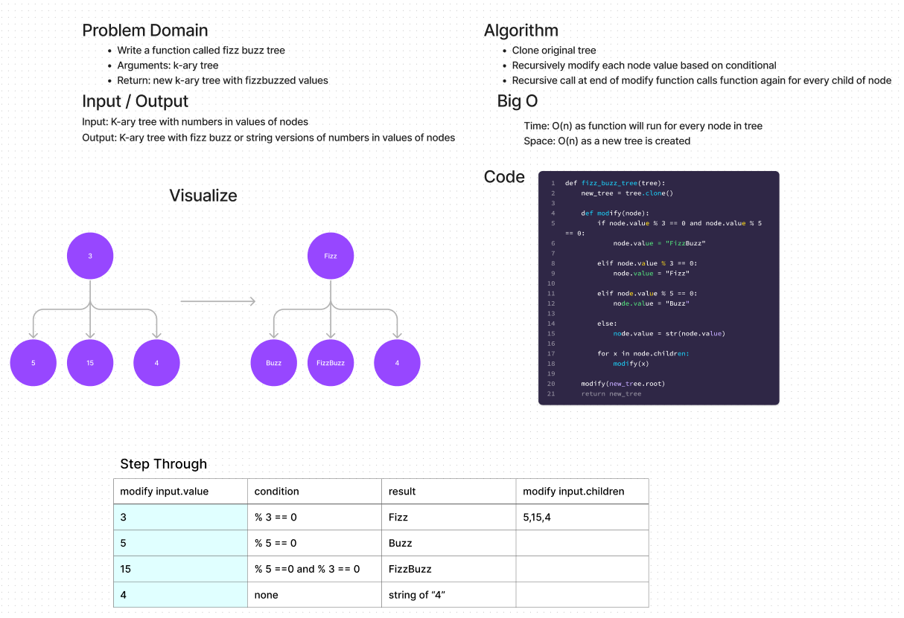

# Challenge Summary
function that creates new tree with identical structure but fizz buzz values

## Whiteboard Process

## Approach & Efficiency
Approach: clone tree and then recursively call modify function for every child node starting with root
Efficiency: O(n) has will need to go through entire list and create new copy

## Solution
- `pytest ./tests/code_challenges/test_fizz_buzz_tree.py`
- This runs the tests for the code
- This code is not set up to be run as main at the moment

## Files
- [code](../../code_challenges/tree_fizz_buzz.py)
- [tests](../../tests/code_challenges/test_tree_fizz_buzz.py)
